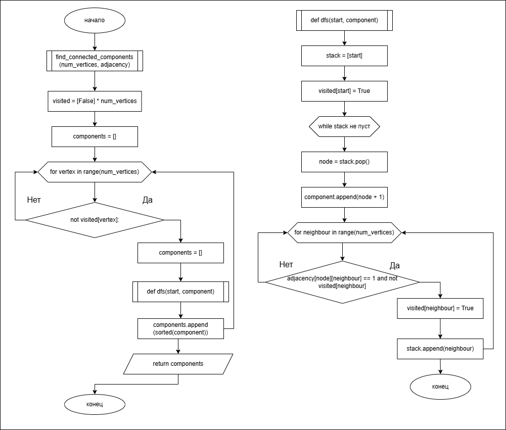
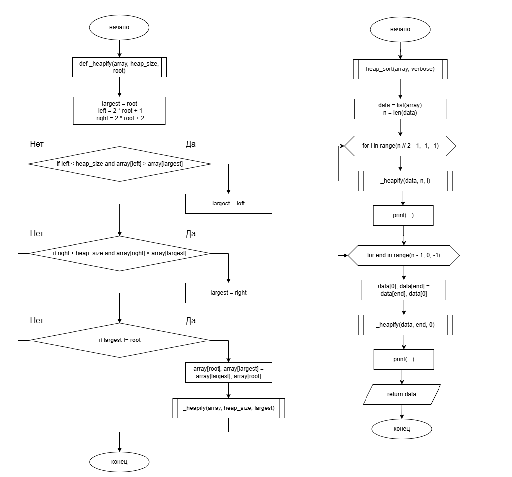

# Лабораторная работа №2. Реализация и обход графов и деревьев на Python

## Автор
ФИО: _______________________  
Группа: _____________________

## Вариант № 19

### Описание варианта

**Граф** — 7 вершин, рёбра:
```
(1,2), (2,3), (3,4), (4,5), (5,6), (6,7)
```

**Дерево** — элементы для построения:
```
{21, 13, 29, 11, 18, 25, 32}
Найти: 25
Удалить: 21
```

**Куча (Heap Sort)** — исходный массив:
```
[21, 13, 29, 11, 18, 25, 32]
```

## Описание реализации

### Структуры данных

**Граф** (`src/graph_algo.py`) представлен двумя матрицами:
- *Матрица смежности* — квадратная матрица `V×V`, где `A[i][j] = 1`, если между вершинами `i` и `j` есть ребро. Граф неориентированный, поэтому матрица симметрична.
- *Матрица инцидентности* — матрица `V×E`, где столбец соответствует ребру, а в строках двух соединяемых вершин стоит `1`.

Поиск компонент связности выполняется обходом в глубину (**DFS**) на итеративном стеке.

**Дерево** (`src/tree_algo.py`) — класс `BST` на основе узлов `Node` (поля `value`, `left`, `right`). Поддерживаются вставка, поиск и удаление. При удалении узла с двумя потомками выполняется замена на преемника — минимальный элемент правого поддерева.

**Куча** — пирамидальная сортировка `heap_sort` строит max-heap на массиве и поэтапно извлекает максимум в конец массива (in-place).

### Сложность алгоритмов (Big O)

| Алгоритм | Сложность |
|---|---|
| Построение матрицы смежности | O(V² + E) |
| Построение матрицы инцидентности | O(V·E) |
| Поиск компонент связности (DFS по матрице) | O(V²) |
| BST: вставка / поиск / удаление | O(log n) в среднем, O(n) в худшем |
| Heap Sort | O(n log n), память O(1) |

## Блок-схемы

Поиск компонент связности (DFS):



Пирамидальная сортировка (Heap Sort):



## Результаты работы программы

```
==================================================
ГРАФ (вариант 19)
==================================================
Вершины: 7
Ребра:   [(1, 2), (2, 3), (3, 4), (4, 5), (5, 6), (6, 7)]

Матрица смежности:
0 1 0 0 0 0 0
1 0 1 0 0 0 0
0 1 0 1 0 0 0
0 0 1 0 1 0 0
0 0 0 1 0 1 0
0 0 0 0 1 0 1
0 0 0 0 0 1 0

Матрица инцидентности:
1 0 0 0 0 0
1 1 0 0 0 0
0 1 1 0 0 0
0 0 1 1 0 0
0 0 0 1 1 0
0 0 0 0 1 1
0 0 0 0 0 1

Количество компонент связности: 1
  Компонента 1: [1, 2, 3, 4, 5, 6, 7]

==================================================
БИНАРНОЕ ДЕРЕВО ПОИСКА (вариант 19)
==================================================
Элементы для вставки: [21, 13, 29, 11, 18, 25, 32]

Симметричный обход (отсортировано): [11, 13, 18, 21, 25, 29, 32]
Поиск значения 25: найдено
Удаление значения 21...
Обход после удаления: [11, 13, 18, 25, 29, 32]

==================================================
ПИРАМИДАЛЬНАЯ СОРТИРОВКА (вариант 19)
==================================================
Исходный массив: [21, 13, 29, 11, 18, 25, 32]

После построения max-heap: [32, 18, 29, 11, 13, 25, 21]
Шаг (зафиксирован индекс 6): [29, 18, 25, 11, 13, 21, 32]
Шаг (зафиксирован индекс 5): [25, 18, 21, 11, 13, 29, 32]
Шаг (зафиксирован индекс 4): [21, 18, 13, 11, 25, 29, 32]
Шаг (зафиксирован индекс 3): [18, 11, 13, 21, 25, 29, 32]
Шаг (зафиксирован индекс 2): [13, 11, 18, 21, 25, 29, 32]
Шаг (зафиксирован индекс 1): [11, 13, 18, 21, 25, 29, 32]

Отсортированный массив: [11, 13, 18, 21, 25, 29, 32]
```

Граф представляет собой простую цепь 1–2–3–4–5–6–7, поэтому имеется **одна** компонента связности, включающая все 7 вершин.

## Инструкция по запуску

```bash
python main.py
```

Требуется Python 3.10+. Сторонние зависимости для запуска не нужны.

## Структура репозитория

```
/lab_02
  /src
    __init__.py
    graph_algo.py     # реализация графов
    tree_algo.py      # реализация BST и heap sort
  main.py             # запуск задач варианта 19
  /diagrams
    dfs_flowchart.png
    heapsort_flowchart.png
  README.md
```

## Ссылка на репозиторий

_Вставьте сюда активную ссылку на ваш репозиторий._
