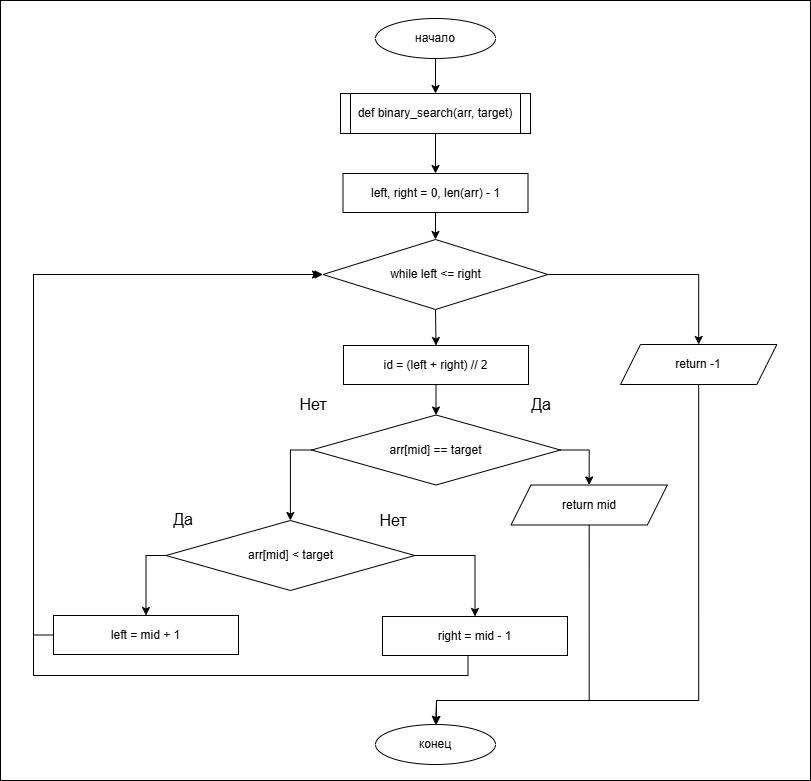
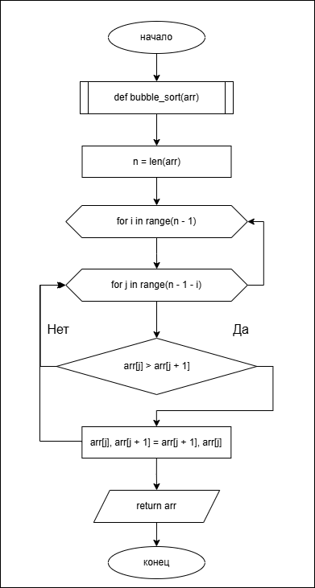
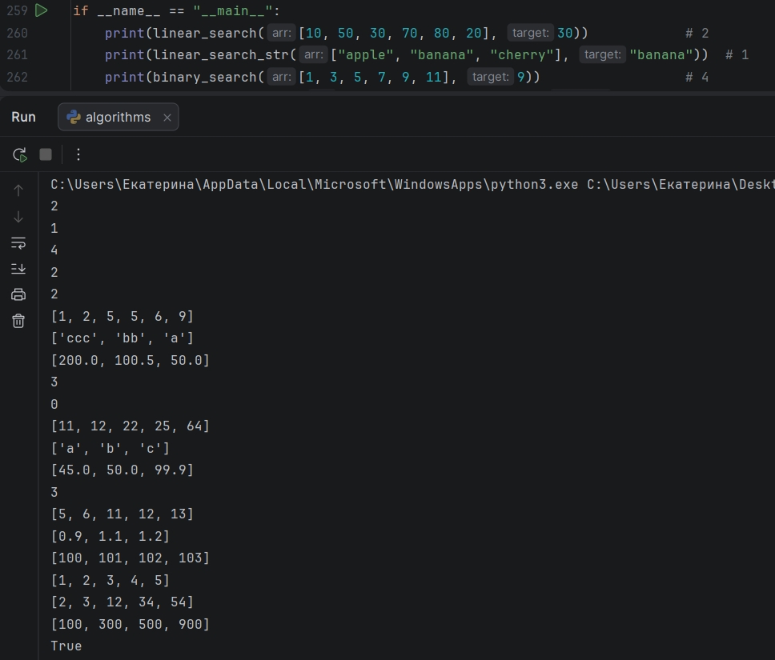

# Лабораторная работа №3

**Тема:** Алгоритмы поиска и сортировки в одномерных массивах
**Вариант:** 19
**Технологический стек:** Python 3.10+

---

## Автор

- **ФИО:** Павлова Екатерина Алексеевна
- **Группа:** ЦИБ-251

---

## Описание

В работе изучены и программно реализованы классические алгоритмы поиска
(линейный и бинарный) и сортировки (пузырьком, выбором, вставками, Шелла).
Все 20 функций собраны в едином файле `main.py` по предоставленному
шаблону для прохождения автоматического тестирования. Сортировки выполняются
«на месте» (in-place) — изменяют исходный список.

**Реализованные алгоритмы:**

- *Поиск:* линейный поиск числа и строки — O(n); бинарный поиск в
  отсортированном массиве — O(log n); бинарный поиск ID транзакции;
  поиск первого клиента с просрочкой выше лимита.
- *Пузырьковая сортировка (O(n²)):* числа по возрастанию, строки по убыванию
  длины, продажи по убыванию, подсчёт числа перестановок.
- *Сортировка выбором (O(n²)):* числа, символы по алфавиту, цены конкурентов,
  поиск индекса минимума.
- *Сортировка вставками (O(n²), эффективна на почти отсортированных данных):*
  целые, float, временные метки заявок.
- *Сортировка Шелла (~O(n^1.5)):* классический вариант с шагом `n // 2`;
  сортировка User ID; проверка отсортированности массива.

---

## Блок-схемы

### Алгоритм поиска — бинарный поиск



### Алгоритм сортировки — пузырьковая сортировка



---

## Примеры запуска

Запуск демонстрационного блока `if __name__ == "__main__":`

```bash
python3 main.py
```

**Скриншот консоли:**



**Текстовый вывод:**

```
2
1
4
2
2
[1, 2, 5, 5, 6, 9]
['ccc', 'bb', 'a']
[200.0, 100.5, 50.0]
3
0
[11, 12, 22, 25, 64]
['a', 'b', 'c']
[45.0, 50.0, 99.9]
3
[5, 6, 11, 12, 13]
[0.9, 1.1, 1.2]
[100, 101, 102, 103]
[1, 2, 3, 4, 5]
[2, 3, 12, 34, 54]
[100, 300, 500, 900]
True
```

Все результаты совпадают с ожидаемыми значениями из тестовых данных.

---

## Ссылка на репозиторий

https://github.com/1skatrina2007-collab/algoritmes/blob/main/lab_03/src/main.py

_________________________
